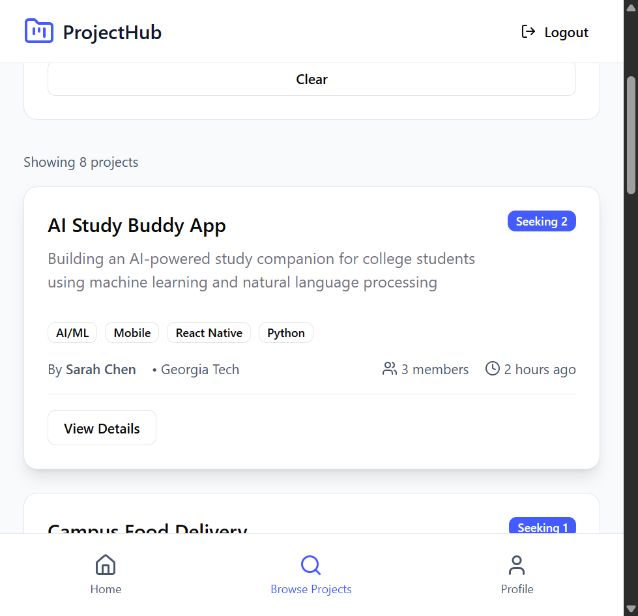
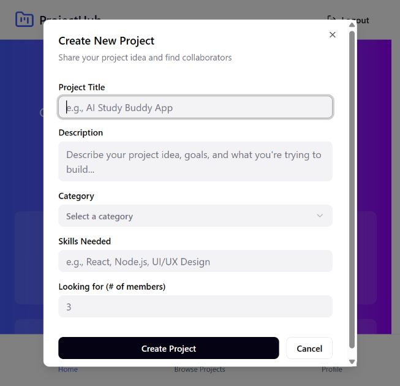
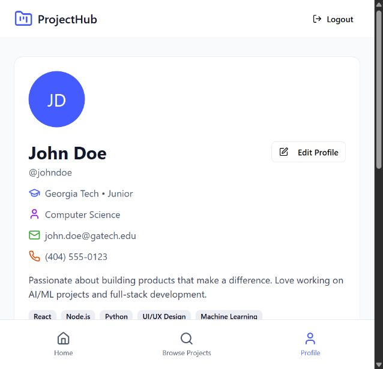
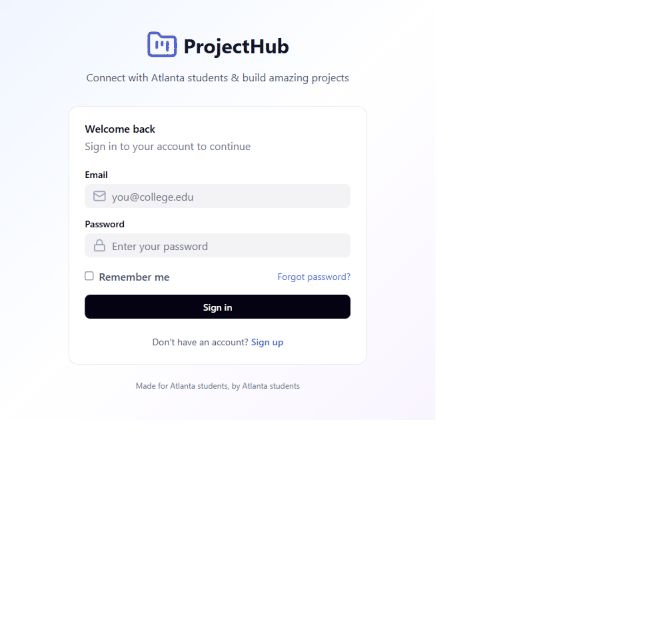

# GitTogether — portfolio project page draft

*Full-stack project collaboration platform · Georgia Tech WebDev team project*

**React · TypeScript · Vite · Node.js · Express · MongoDB · Mongoose · JWT**

Collaborated on a MERN application through Georgia Tech WebDev. My backend work focused on registration and login, JWT issuance, and the Mongoose Project model. Teammates built the user profile API, project controllers and authorization, and frontend screens.

**Buttons for the future portfolio:** **View Project** → this project page on your own portfolio; **[GitHub](https://github.com/dylansoutter/DylanSoutterGitTogether)** → the existing fork. Do not label the UI preview as a live demo.

## What I built

```text
Registration / login request
  └── Express auth routes and controller
        ├── validate input and check duplicate accounts
        ├── hash passwords with bcrypt
        └── issue a signed JWT

Project model
  ├── title, description, tech stack, needed roles
  ├── creator → User reference
  └── college, open status, timestamps
```

## Team architecture

```text
React frontend → Express API → Mongoose → MongoDB
                         ├── Auth: register / login → JWT
                         ├── Profile: GET / PATCH /api/users/me
                         └── Projects: create / list / detail / edit / delete
                                       └── creator authorization for edit/delete
```

## Screenshots and UI walkthrough

These show the current **frontend prototype**, which still uses the name “ProjectHub.” Its dashboard, project listings, creation dialog, and profile contain sample data. The creation dialog does not persist to the API yet.










## Status

The backend exposes auth, profile, and project routes. Registration and login forms call the backend, but the active frontend's project and profile screens are not fully connected to those routes. A live deployment should wait until that integration and a complete production build are verified. The repository remains a fork to show team ownership and history.
